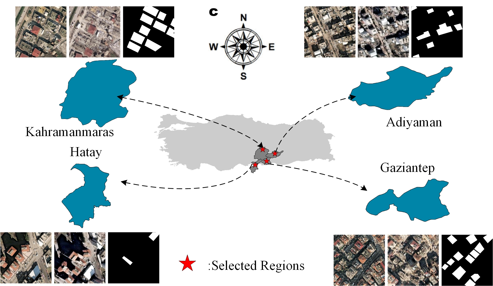

# MSI-Net
The offical implementation of 
Building damage estimation in earthquake: A multi-scale interaction network with offset calibration and a change detection dataset

# TUE-CD dataset
A change detection detection for building damage estimation after earthquake

the dataset is avaliable at：https://pan.baidu.com/s/1FSQz4Dyi-gO0PzV-bu0E9A?pwd=tue1 

The link of Google griver: https://drive.google.com/file/d/1tQFQQXOCkb-2iaF0NhB9u_O45db04HkD/view?usp=sharing

# Introduction of the TUE-CD dataset
 To efficiently estimate the damage after earthquakes, we construct a TUE-CD dataset, in which the bi-temporal RS images are obtained by the WorldView-2 satellite from Turkey. Specifically, a devastating magnitude 7.8 earthquake struck the southern part of Turkey bordering Syria at 4.17 a.m. local time on Monday, 6 February 2023. The epicenter of the earthquake is located approximately 23 kilometers east of Nurdaji, Gaziantep province (37.174°N, 37.032°E), which is near the Syrian border. These regions has experienced the strongest earthquakes in this century. The damage caused by this quake has exceeded 104 billion dollars. According to the public RS images from Maxar, 1656 image patches with the size of 256×256 are prepared and cover the most severely affected areas shown in Fig. 6, such as Adiyaman, Kahramanmaras, Hatay, and Gaziantep. In the TUE-CD dataset, 2338 destroyed buildings are labeled.
 
